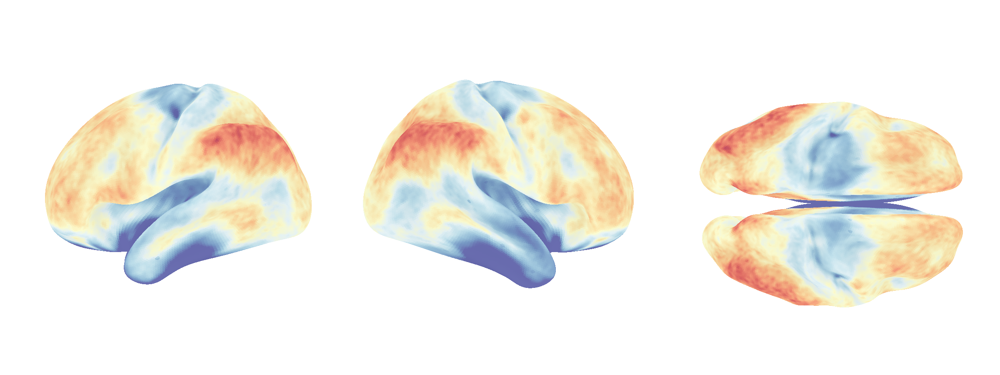
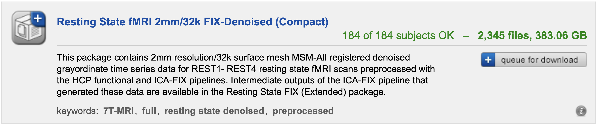

### fMRI-timescales
> Estimating fMRI Timescale Maps



**Project Organization**
```
.
├── fmri_timescales/
    ├── acf_utils.py                <- autocorrelation estimators
    ├── plts.py                     <- plotting functions
    ├── sim.py                      <- simulation functions
    └── timescale_utils.py          <- timescale estimators
├── tests/
    └── ...                         <- unit tests for fmri_timescales/
├── notebooks
    ├── data/                       <- N=180 timescale (+ std error) maps from the HCP
    ├── fig01to03.ipynb             <- simulation results
    ├── fig01to03.py                <- supporting functions
    ├── fig04to05.ipynb             <- timescale map results
    ├── fig04to05.py                <- supporting function
    └── ...                         <- supplementary notebooks (not in manuscript)
├── figures/                        <- figures derived from notebooks/
├── latex/
    ├── ...                         <- latex files
    ├── main.pdf                    <- manuscript
    ├── slides.pdf                  <- presentation slides
    └── zotero.bib                  <- references 

├── LICENSE                         <- MIT license
├── README.md                       <- this README file
└── pyproject.toml                  <- python configuration and dependencies
```

**Data Availability**  
The `notebooks/data/*{tau,se}.npy` files contain the LLS and NLS timescale estimates at each grayordinate (180 subjects, 91282 regions), from which the `figures/` can be reproduced. Access to the ~380GB of resting fMRI data from the Human Connectome Project 2018 release can by downloaded at [ConnetomeDB](https://db.humanconnectome.org/app/template/Login.vm):



**Code Installation**  

Clone this repository:
```
git clone https://github.com/griegner/fmri-timescales.git
cd fmri-timescales
```

Create virtual environment using `pip` or `conda`:
```
# pip
python3 -m venv .fmri-timescales
source .fmri-timescales/bin/activate 
```

```
# conda
conda create --name fmri-timescales python
conda activate fmri-timescales
```


Install `fmri_timescales` and dependencies:
```
pip install --editable ".[notebooks]"
```

**Usage Examples**

Time Domain Linear Model, Fit by Linear Least Squares (LLS):
```python
    >>> from fmri_timescales import sim, timescale_utils
    >>> X = sim.sim_ar(ar_coeffs=[0.8], n_timepoints=1000) # x_t = 0.8 x_{t-1} + e_t
    >>> lls = timescale_utils.LLS(var_estimator="newey-west")
    >>> lls.fit(X=X, n_timepoints=1000)
    {
        'phi': array([0.79789847]), 
        'se(phi)': array([0.02028763]), 
        'tau': array([4.42920958]), 
        'se(tau)': array([0.49881125])
    }
```

Autocorrelation Domain Nonlinear Model, Fit by Nonlinear Least Squares (NLS):
```python
    >>> from fmri_timescales import sim, timescale_utils
    >>> X = sim.sim_ar(ar_coeffs=[0.8], n_timepoints=1000) # x_t = 0.8 x_{t-1} + e_t
    >>> nls = timescale_utils.NLS(var_estimator="newey-west")
    >>> nls.fit(X=X, n_timepoints=1000)
    {
        'phi': array([0.78021159]), 
        'se(phi)': array([0.01071285]), 
        'tau': array([4.02916908]), 
        'se(tau)': array([0.22290691])
    }
```