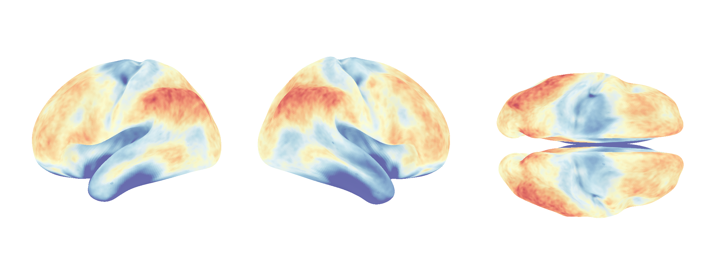
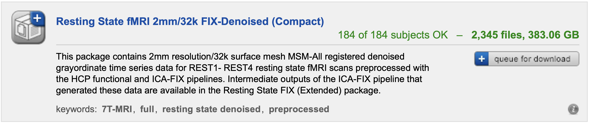

### fMRI-timescales
> Estimating fMRI Timescale Maps



[](https://griegner.github.io/fmri-timescales/wnar.pdf)
[](https://griegner.github.io/fmri-timescales/main.pdf)

**Project Organization**
```
.
├── fmri_timescales/
    ├── acf_utils.py                <- autocorrelation estimators
    ├── plts.py                     <- plotting functions
    ├── sim.py                      <- simulation functions
    └── timescale_utils.py          <- timescale estimators
├── tests/
    └── ...                         <- unit tests for fmri_timescales/
├── notebooks
    ├── data/                       <- N=180 timescale (+ std error) maps from the HCP
    ├── fig01to03.ipynb             <- simulation results
    ├── fig01to03.py                <- supporting functions
    ├── fig04to05.ipynb             <- timescale map results
    ├── fig04to05.py                <- supporting function
    └── ...                         <- supplementary notebooks (not in manuscript)
├── figures/                        <- figures derived from notebooks/
├── docs/
    ├── ...                         <- latex files
    ├── main.pdf                    <- manuscript
    ├── slides.pdf                  <- presentation slides
    └── zotero.bib                  <- references

├── LICENSE                         <- MIT license
├── README.md                       <- this README file
└── pyproject.toml                  <- python configuration and dependencies
```

**Data Availability**
The `notebooks/data/*{tau,se}.npy` files contain the TD and AD timescale estimates at each grayordinate (180 subjects, 91282 regions), from which the `figures/` can be reproduced. Access to the ~380GB of resting fMRI data from the Human Connectome Project 2018 release can by downloaded at [ConnetomeDB](https://db.humanconnectome.org/app/template/Login.vm):



**Code Installation**

Clone this repository:
```
git clone https://github.com/griegner/fmri-timescales.git
cd fmri-timescales
```

Create virtual environment using `pip` or `conda`:
```
# pip
python3 -m venv .fmri-timescales
source .fmri-timescales/bin/activate
```

```
# conda
conda create --name fmri-timescales python
conda activate fmri-timescales
```


Install `fmri_timescales` and dependencies:
```
pip install --editable ".[notebooks]"
```

**Usage Examples**

Time Domain (TD) Linear Model, Fit by Linear Least Squares:
```python
    >>> from fmri_timescales import sim, timescale_utils
    >>> X = sim.sim_ar(ar_coeffs=[0.8], n_timepoints=1000) # x_t = 0.8 x_{t-1} + e_t
    >>> td = timescale_utils.TD(var_estimator="newey-west", var_n_lags=10)
    >>> td.fit(X=X, n_timepoints=1000).estimates_
    {
        'phi': array([0.79789847]),
        'se(phi)': array([0.02045074]),
        'tau': array([4.42920958]),
        'se(tau)': array([0.50282146])
    }
```

Autocorrelation Domain (AD) Nonlinear Model, Fit by Nonlinear Least Squares:
```python
    >>> from fmri_timescales import sim, timescale_utils
    >>> X = sim.sim_ar(ar_coeffs=[0.8], n_timepoints=1000) # x_t = 0.8 x_{t-1} + e_t
    >>> ad = timescale_utils.AD(var_domain="time", var_estimator="newey-west", var_n_lags=10)
    >>> ad.fit(X=X, n_timepoints=1000).estimates_
    {
        'phi': array([0.78021651]),
        'se(phi)': array([0.02814532]),
        'tau': array([4.02927146]),
        'se(tau)': array([0.58565806])
    }
```
