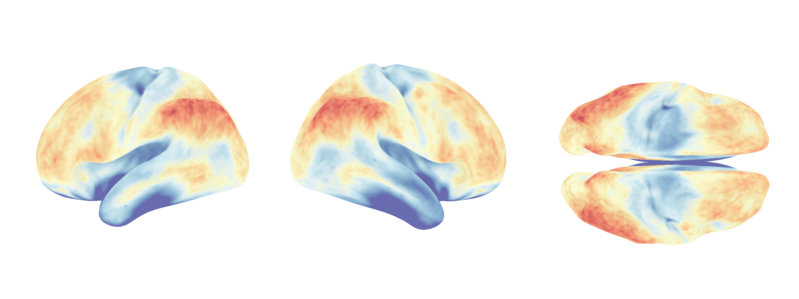
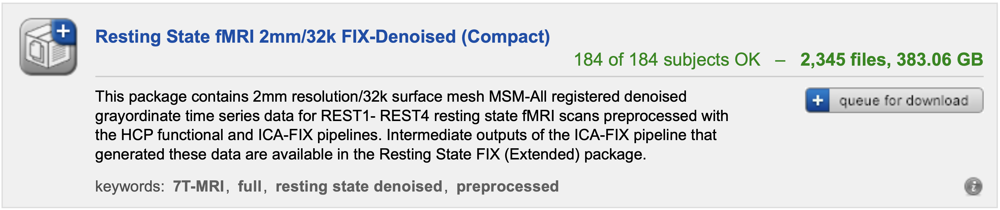

### fMRI-timescales
> Estimating fMRI Timescale Maps



<a href="https://doi.org/10.1162/IMAG.a.1248">
    
</a>

[](https://codecov.io/gh/griegner/fmri-timescales)

#### Overview

This repository provides two methods for estimating fMRI timescale maps:
- A time-domain (TD) fit of an autoregressive model.
- An autocorrelation-domain (AD) fit of an exponential decay model.

Rather than assuming the fMRI time series has exponential autocorrelation decay, these methods estimate timescales by treating the models as approximations. This approach requires only stationarity and mixing assumptions, while incorporating robust standard errors to account for likely model misspecification.

*Method Implementation*: To use the `fmri-timescales` package, follow the installation instructions and usage examples provided below.

*Paper Reproduction*: Reproduces the figures (`figures/*.png`) from the *Imaging Neuroscience* paper by running the corresponding notebooks (`notebooks/*.ipynb`).

*Citation*:
```bibtex
@article{riegner_estimating_2026,
	title = {Estimating fMRI Timescale Maps},
	doi = {10.1162/IMAG.a.1248},
	journal = {Imaging Neuroscience},
	author = {Riegner, Gabriel and Davenport, Samuel and Voytek, Bradley and Schwartzman, Armin},
	year = {2026},
}
```

#### Package Installation

Install `fmri-timescales` and its dependencies using pip:

```bash
pip install git+https://github.com/griegner/fmri-timescales.git
```

#### Usage Examples

Time Domain (TD) Linear Model, Fit by Linear Least Squares:
```python
    >>> from fmri_timescales import sim, timescale_utils
    >>> X = sim.sim_ar(ar_coeffs=[0.8], n_timepoints=1000) # x_t = 0.8 x_{t-1} + e_t
    >>> td = timescale_utils.TD(var_estimator="newey-west", var_n_lags=10)
    >>> td.fit(X=X, n_timepoints=1000).estimates_
    {
        'phi': array([0.79789847]),
        'se(phi)': array([0.02045074]),
        'tau': array([4.42920958]),
        'se(tau)': array([0.50282146])
    }
```

Autocorrelation Domain (AD) Nonlinear Model, Fit by Nonlinear Least Squares:
```python
    >>> from fmri_timescales import sim, timescale_utils
    >>> X = sim.sim_ar(ar_coeffs=[0.8], n_timepoints=1000) # x_t = 0.8 x_{t-1} + e_t
    >>> ad = timescale_utils.AD(var_estimator="newey-west", var_n_lags=10, acf_n_lags=50)
    >>> ad.fit(X=X, n_timepoints=1000).estimates_
    {
        'phi': array([0.78021651]),
        'se(phi)': array([0.02814532]),
        'tau': array([4.02927146]),
        'se(tau)': array([0.58565806])
    }
```

#### Repository Organization
```text
.
├── fmri_timescales/
    ├── acf_utils.py                <- autocorrelation estimators
    ├── plts.py                     <- plotting functions
    ├── sim.py                      <- simulation functions
    └── timescale_utils.py          <- timescale estimators
├── tests/
    └── ...                         <- unit tests for fmri_timescales/
├── notebooks
    ├── data/                       <- N=180 timescale (+ std error) maps from the HCP
    ├── fig01to03.ipynb             <- simulation results
    ├── fig01to03.py                <- supporting functions
    ├── fig04to05.ipynb             <- timescale map results
    ├── fig04to05.py                <- supporting function
    └── ...                         <- supplementary notebooks (not in manuscript)
├── figures/                        <- figures derived from notebooks/
├── docs/
    ├── *.tex                       <- latex files
    ├── wnar.pdf                    <- presentation slides
    └── zotero.bib                  <- references

├── LICENSE                         <- MIT license
├── README.md                       <- this README file
└── pyproject.toml                  <- python configuration and dependencies
```

#### Data Availability

The `notebooks/data/*{tau,se}.npy` files contain the TD and AD timescale estimates at each grayordinate (180 subjects, 91282 regions), from which the `figures/*.png` files can be reproduced. Access to the ~380GB of resting fMRI data from the Human Connectome Project 2018 release can by downloaded from [ConnectomeDB](https://db.humanconnectome.org/app/template/Login.vm):


